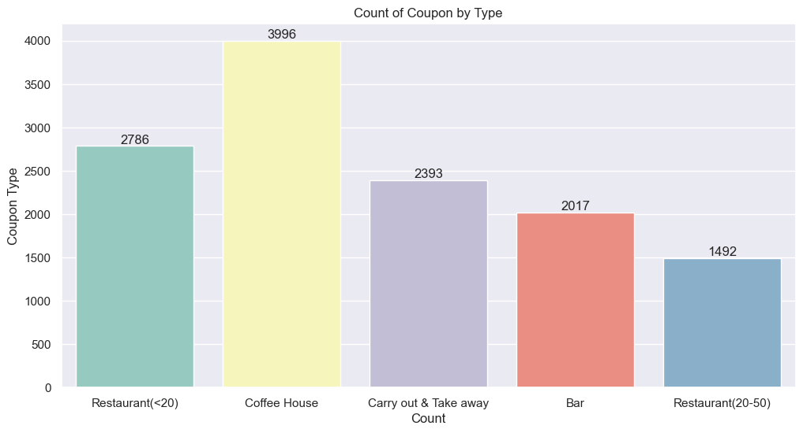
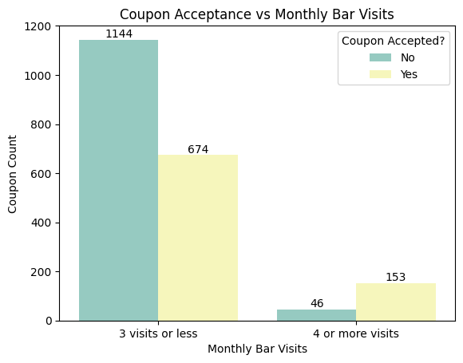
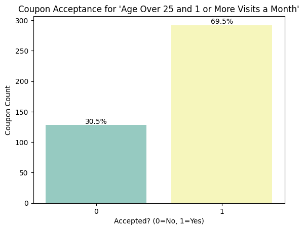
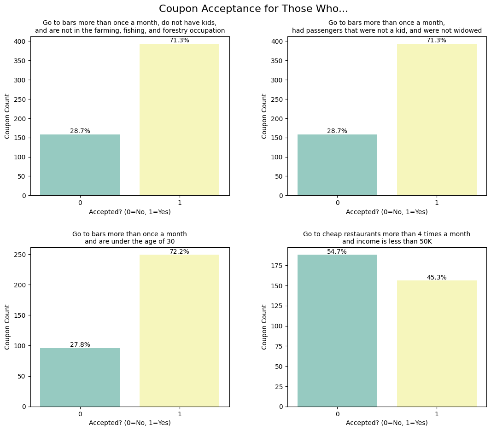
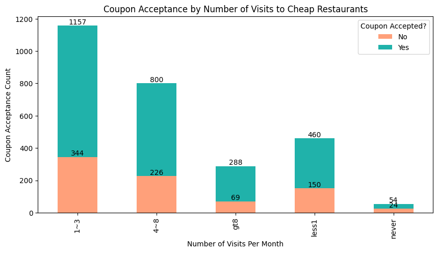
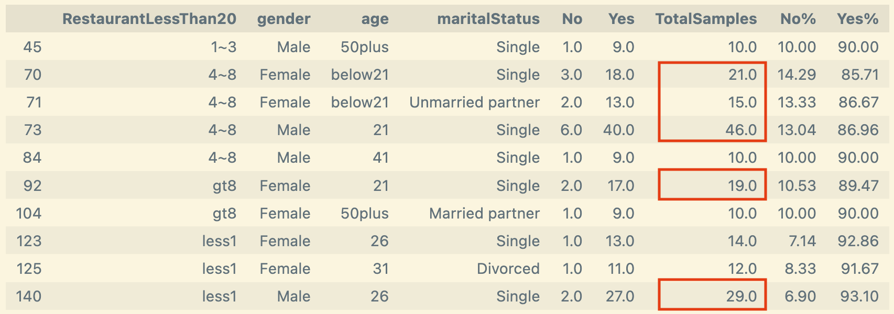
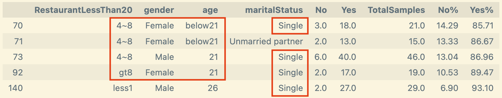
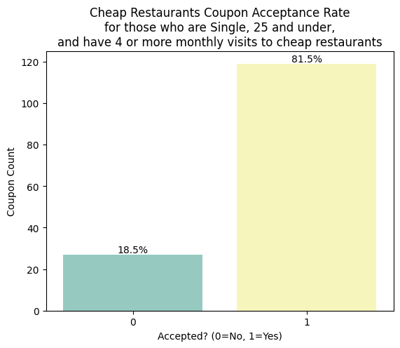

### Will a Customer Accept the Coupon?

**Context**

Imagine driving through town and a coupon is delivered to your cell phone for a restaraunt near where you are driving. Would you accept that coupon and take a short detour to the restaraunt? Would you accept the coupon but use it on a subsequent trip? Would you ignore the coupon entirely? What if the coupon was for a bar instead of a restaraunt? What about a coffee house? Would you accept a bar coupon with a minor passenger in the car? What about if it was just you and your partner in the car? Would weather impact the rate of acceptance? What about the time of day?

Obviously, proximity to the business is a factor on whether the coupon is delivered to the driver or not, but what are the factors that determine whether a driver accepts the coupon once it is delivered to them? How would you determine whether a driver is likely to accept a coupon?

**Data**

This data comes to us from the [UCI Machine Learning repository](https://archive.ics.uci.edu/dataset/603/in+vehicle+coupon+recommendation) and was collected via a survey on Amazon Mechanical Turk. 

The survey describes different driving scenarios including the destination, current time, weather, passenger, etc., and then ask the person whether he will accept the coupon if he is the driver. Answers that the user will drive there ‘right away’ or ‘later before the coupon expires’ are labeled as ‘Y = 1’ and answers ‘no, I do not want the coupon’ are labeled as ‘Y = 0’.  

There are five different types of coupons:
* less expensive restaurants (under $20)
* coffee houses
* carry out & take away
* bar
* more expensive restaurants ($20 - $50)

# Exploratory Data Analysis
The dataset had a total of 12,684 rows and 26 columns.  Columns with missing values were:

| Column (Feature) | Missing Values Count | Unique Values |
|:-----:|:--------:|:------:|
| `car` | **12576** | `Scooter and motorcycle`, `Mazda5`, `do not drive`, `crossover`, `Car that is too old to install Onstar :D` |
| `Bar` |  107  | `never`, `less1`, `1~3`, `4~8`, `gt8` |
| `CoffeeHouse` | 217 | `never`, `less1`, `1~3`, `4~8`, `gt8` |
| `CarryAway` | 151 | `never`, `less1`, `1~3`, `4~8`, `gt8` |
| `RestaurantLessThan20` | 130 | `never`, `less1`, `1~3`, `4~8`, `gt8` |
| `Restaurant20To50` | 189 | `never`, `less1`, `1~3`, `4~8`, `gt8` |

The `car` column had over 99% missing values and the values that were there are not super useful.  Hence, `car` ended up being dropped.

Here are the number of coupons broken out by coupon types:

# Analyzing Bar-related Coupons

Out of all bar-related coupons, only 41% were accepted.

If we split the samples into those who visited bars 3 or few times a month and those who visited more, we get the following:

We can see that over 76% of those who had 4 or more monthly bar visits accepted bar coupons when one came up.  This is in contrast to only 37% acceptance for those who do not frequent bars (3 or less visits per month).  In other words, those who went to bars 4+ times a month are more than twice as likely to accept a 'Bar' coupon as those who went 3 times or less.

Let's look at the coupon acceptance from a few other perspectives:

Based on the above, we can hypothesize that drivers who accepted bar coupons are **_single_**, **_between 26 to 30 years old_**, and already **_visit bars one or more times a month_**.

# Analyzing Coupon Acceptance for Cheap Resturants (i.e. those under $20)

There were 2786 coupon samples for cheap restaurants.  Over 70% of these coupons were accepted which indicates they were well-received by most drivers.

To better analyze the data, the samples were grouped by _monthly frequency of visits_, _gender_, _age_, and _marital status_.  The counts of Yes ('Accepted') and No ('Not accepted') coupons were recorded for each group; new columns were added to hold percentages.

Filtering for acceptance rates over 85% yielded:

Adding another filter to grab only groups with least 15 samples:

Notice the common characteristics for these groups.  Let's plot the acceptance rate for drivers with these characteristics:
